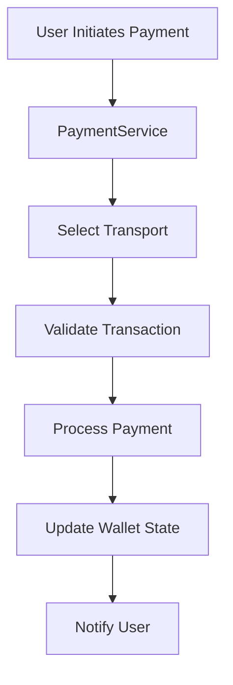
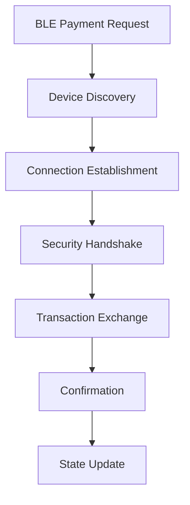

# AirChainPay Wallet - Technical Architecture

## System Overview

The AirChainPay Wallet is a React Native application built with TypeScript that implements a multi-transport cryptocurrency payment system. The architecture follows a layered approach with clear separation of concerns.

## Architecture Layers

### 1. Presentation Layer (`app/`, `components/`)
- **React Native Screens**: User interface components
- **Navigation**: Expo Router for screen navigation
- **UI Components**: Reusable themed components
- **State Management**: React hooks and context

### 2. Business Logic Layer (`src/services/`)
- **Payment Processing**: Core payment logic
- **Transaction Management**: Transaction lifecycle
- **Blockchain Integration**: On-chain operations
- **Transport Layer**: Multi-transport communication

### 3. Data Layer (`src/wallet/`, `src/storage/`)
- **Wallet Management**: Multi-chain wallet operations
- **Secure Storage**: Encrypted data persistence
- **Cache Management**: Performance optimization

### 4. Infrastructure Layer (`src/utils/`, `src/constants/`)
- **Utilities**: Helper functions and utilities
- **Configuration**: App constants and settings
- **Security**: Cryptographic operations

## Core Components Deep Dive

### Payment Service Architecture

```typescript
// PaymentService.ts - Main payment orchestrator
class PaymentService {
  private transports: Map<TransportType, BaseTransport>
  
  async sendPayment(transaction: Transaction): Promise<PaymentResult> {
    const transport = this.selectTransport(transaction.type)
    return await transport.sendPayment(transaction)
  }
}
```

### Transport Layer Design

The wallet implements a pluggable transport architecture:

#### BLE Transport (`src/services/transports/BLETransport.ts`)
```typescript
class BLETransport extends BaseTransport {
  async sendPayment(transaction: Transaction): Promise<PaymentResult> {
    // 1. Establish BLE connection
    // 2. Negotiate security parameters
    // 3. Send encrypted transaction data
    // 4. Receive confirmation
  }
}
```

#### QR Transport (`src/services/transports/QRTransport.ts`)
```typescript
class QRTransport extends BaseTransport {
  async sendPayment(transaction: Transaction): Promise<PaymentResult> {
    // 1. Generate QR code with transaction data
    // 2. Display for recipient scanning
    // 3. Monitor for confirmation
  }
}
```

#### On-Chain Transport (`src/services/transports/OnChainTransport.ts`)
```typescript
class OnChainTransport extends BaseTransport {
  async sendPayment(transaction: Transaction): Promise<PaymentResult> {
    // 1. Sign transaction with private key
    // 2. Submit to blockchain network
    // 3. Monitor for confirmation
  }
}
```

### Wallet Management Architecture

#### Multi-Chain Wallet Manager (`src/wallet/MultiChainWalletManager.ts`)
```typescript
class MultiChainWalletManager {
  private wallets: Map<ChainId, TokenWalletManager>
  
  async createWallet(chainId: ChainId): Promise<Wallet>
  async getBalance(chainId: ChainId, token: string): Promise<Balance>
  async sendTransaction(chainId: ChainId, transaction: Transaction): Promise<TxResult>
}
```

#### Token Wallet Manager (`src/wallet/TokenWalletManager.ts`)
```typescript
class TokenWalletManager {
  async getTokenBalance(tokenAddress: string): Promise<BigNumber>
  async estimateGas(transaction: Transaction): Promise<BigNumber>
  async signTransaction(transaction: Transaction): Promise<SignedTransaction>
}
```

## Security Architecture

### Cryptographic Security

#### Wallet Encryption (`src/utils/crypto/WalletEncryption.ts`)
```typescript
class WalletEncryption {
  async encryptWallet(wallet: Wallet, password: string): Promise<EncryptedWallet>
  async decryptWallet(encryptedWallet: EncryptedWallet, password: string): Promise<Wallet>
  generateKeyPair(): KeyPair
}
```

#### BLE Security (`src/utils/crypto/BLESecurity.ts`)
```typescript
class BLESecurity {
  async establishSecureChannel(device: BLEDevice): Promise<SecureChannel>
  async encryptPayload(payload: Buffer, key: Buffer): Promise<Buffer>
  async decryptPayload(encryptedPayload: Buffer, key: Buffer): Promise<Buffer>
}
```

### Secure Storage

```typescript
// SecureStorageService.ts - Hardware-backed secure storage
class SecureStorageService {
  async setItem(key: string, value: string, options?: StorageOptions): Promise<void>
  async getItem(key: string, options?: RetrievalOptions): Promise<string | null>
  async deleteItem(key: string): Promise<void>
  async migrateFromSecureStore(keys: string[]): Promise<void>
  getSecurityLevel(): string
  isKeychainAvailable(): boolean
}
```

## Data Flow Architecture

### Payment Flow



### BLE Payment Flow



## State Management

### React Context Architecture

```typescript
// Theme Context
const ThemeContext = createContext<ThemeContextType>()

// Auth Context
const AuthContext = createContext<AuthContextType>()

// Wallet Context
const WalletContext = createContext<WalletContextType>()
```

### State Persistence

```typescript
// Persistent state management
class StateManager {
  async persistState(state: AppState): Promise<void>
  async restoreState(): Promise<AppState>
  async clearState(): Promise<void>
}
```

## Network Architecture

### Blockchain Integration

#### RPC Client Management
```typescript
class RPCClientManager {
  private clients: Map<ChainId, RPCClient>
  
  getClient(chainId: ChainId): RPCClient
  async getBlockNumber(chainId: ChainId): Promise<number>
  async getGasPrice(chainId: ChainId): Promise<BigNumber>
}
```

#### Transaction Broadcasting
```typescript
class TransactionBroadcaster {
  async broadcastTransaction(signedTx: SignedTransaction): Promise<string>
  async waitForConfirmation(txHash: string): Promise<TransactionReceipt>
}
```

### BLE Network Stack

```typescript
// BLE Protocol Stack
interface BLEProtocol {
  // Physical Layer
  scanForDevices(): Promise<BLEDevice[]>
  connectToDevice(device: BLEDevice): Promise<BLEConnection>
  
  // Data Link Layer
  sendData(data: Buffer): Promise<void>
  receiveData(): Promise<Buffer>
  
  // Application Layer
  sendTransaction(transaction: Transaction): Promise<PaymentResult>
}
```

## Performance Architecture

### Caching Strategy

```typescript
// Multi-level caching
class CacheManager {
  private memoryCache: Map<string, any>
  private diskCache: AsyncStorage
  
  async get(key: string): Promise<any>
  async set(key: string, value: any, ttl?: number): Promise<void>
  async invalidate(pattern: string): Promise<void>
}
```

### Transaction Queue

```typescript
// Transaction processing queue
class TxQueue {
  private queue: Transaction[]
  private processing: boolean
  
  async addTransaction(transaction: Transaction): Promise<void>
  async processQueue(): Promise<void>
  async retryFailedTransactions(): Promise<void>
}
```

## Error Handling Architecture

### Error Hierarchy

```typescript
// Custom error types
class WalletError extends Error {
  constructor(message: string, public code: string) {
    super(message)
  }
}

class BLEError extends WalletError {
  constructor(message: string, public deviceId?: string) {
    super(message, 'BLE_ERROR')
  }
}

class TransactionError extends WalletError {
  constructor(message: string, public txHash?: string) {
    super(message, 'TRANSACTION_ERROR')
  }
}
```

### Error Recovery

```typescript
// Error recovery strategies
class ErrorRecovery {
  async handleBLEError(error: BLEError): Promise<void>
  async handleTransactionError(error: TransactionError): Promise<void>
  async retryOperation<T>(operation: () => Promise<T>): Promise<T>
}
```

## Testing Architecture

### Unit Testing Strategy

```typescript
// Test utilities
class TestUtils {
  static createMockWallet(): Wallet
  static createMockTransaction(): Transaction
  static createMockBLEDevice(): BLEDevice
}
```

### Integration Testing

```typescript
// Integration test setup
class IntegrationTestSuite {
  async setupTestEnvironment(): Promise<void>
  async teardownTestEnvironment(): Promise<void>
  async runPaymentFlowTest(): Promise<void>
}
```

## Deployment Architecture

### Build Configuration

```javascript
// app.config.js - Expo configuration
export default {
  expo: {
    name: 'AirChainPay Wallet',
    slug: 'airchainpay-wallet',
    version: '1.0.0',
    platforms: ['ios', 'android'],
    // ... other config
  }
}
```

### Environment Management

```typescript
// Environment configuration
interface Environment {
  apiUrl: string
  rpcUrls: Record<ChainId, string>
  contractAddresses: Record<ChainId, string>
  debugMode: boolean
}
```

## Monitoring and Observability

### Logging Architecture

```typescript
// Structured logging
class Logger {
  info(message: string, context?: any): void
  error(message: string, error?: Error): void
  warn(message: string, context?: any): void
  debug(message: string, context?: any): void
}
```

### Metrics Collection

```typescript
// Performance metrics
class MetricsCollector {
  recordTransactionTime(duration: number): void
  recordBLEConnectionTime(duration: number): void
  recordError(error: Error): void
  recordUserAction(action: string): void
}
```

## Future Architecture Considerations

### Scalability

- **Microservices**: Consider breaking into microservices
- **Database**: Implement proper database for transaction history
- **Caching**: Redis for high-performance caching
- **Load Balancing**: For API endpoints

### Security Enhancements

- **Hardware Security**: Integration with hardware security modules
- **Multi-Signature**: Support for multi-signature wallets
- **Audit Trail**: Comprehensive audit logging
- **Penetration Testing**: Regular security assessments

### Performance Optimizations

- **Code Splitting**: Lazy loading of components
- **Image Optimization**: Efficient image handling
- **Memory Management**: Proper memory cleanup
- **Bundle Optimization**: Minimize bundle size

---

*This technical architecture document should be updated as the system evolves. Maintain this document alongside code changes to ensure architectural consistency.* 